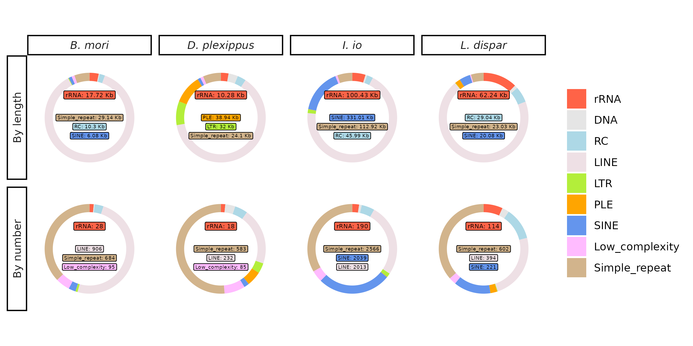
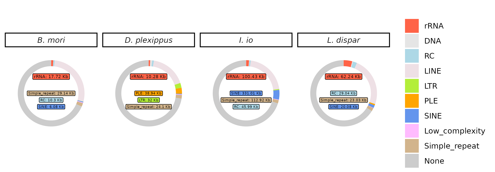

eccDNA_detection
================
Bulah Wu
2025-09-30

## Sequencing input

## eccDNA length distribution

## repeat elements in eccDNA

## length of repeat elements in eccDNA

## Repeat classification

## eccDNA/rDNA cluster location on chromosomes

## eccDNA/rDNA cluster location on unplaced scaffolds

