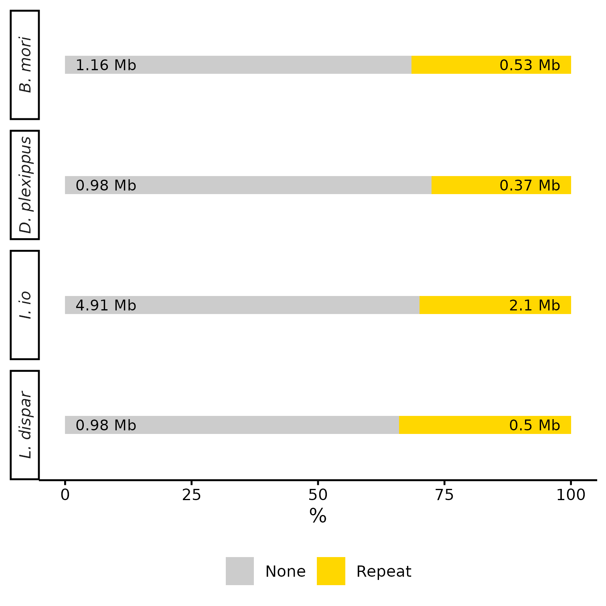

Detection and Analysis of eccDNA in Four Lepidopteran Species
================

**Author:** Bulah Wu  
**Date:** 2025-10-02 <!--

 -->

------------------------------------------------------------------------

### Raw and Mapped Sequencing Bases by Species

**Figure 1.** Sequencing input data for four lepidopteran species, each
comprising three biological replicates. The blue bars represent the
total number of raw sequencing bases generated for each replicate. The
orange bars indicate the number of bases successfully mapped to the
corresponding reference genome. The dotted boxes outline the approximate
size of each species’ genome. The percentage values displayed adjacent
to the bars represent the sequencing coverage relative to the genome
size, providing an estimate of how thoroughly each genome was sequenced.

------------------------------------------------------------------------

### Length Distribution of eccDNA Across Species

**Figure 2.** Distribution of eccDNA lengths across four lepidopteran
species. Violin plots represent the density distribution of full-length
eccDNAs, with embedded boxplots indicating the median and interquartile
range for each group. Each point represents an individual eccDNA.
eccDNAs containing rDNA genes (18S, 5.8S, and 28S) are highlighted in
red.

------------------------------------------------------------------------

### Repeat and Non-Repeat Content of eccDNA by Species

**Figure 3.** Composition of repeat and non-repeat elements in eccDNA
across four lepidopteran species. Each horizontal bar represents the
total eccDNA length per species, partitioned by whether the sequence
overlaps with annotated repeat elements (“Repeat”) or not (“None”). Bars
are scaled to show the percentage composition (by length), with actual
total eccDNA length (in megabases) labeled within each bar.
Repeat-derived eccDNAs are shown in gold; non-repeat eccDNAs are shown
in grey.

------------------------------------------------------------------------

### Repeat elements in eccDNA

**Figure 4.** Classification of repeat elements identified in eccDNAs
from four lepidopteran species, annotated using RepeatMasker. Data are
presented as stacked bar plots, with proportions calculated by either
total sequence length (top row) or number of elements (bottom row). Each
subplot shows the relative contribution of different repeat classes
within each species. The labels for the rRNA class, as well as for the
three most abundant repeat classes in each species, are positioned
alongside the bars.

------------------------------------------------------------------------

### Repeat Composition of rDNA-Associated eccDNAs

**Figure 5.** Repeat classification of eccDNAs containing rRNA genes
(18S, 5.8S, and 28S) across four lepidopteran species. Horizontal bars
represent eccDNA sequences with length proportional to their actual size
(in kilobases). The main block (grey) indicates the full eccDNA regions,
while colored sub-blocks denote annotated repeat elements within these
eccDNAs, as shown in the legend.

------------------------------------------------------------------------

### rDNA-Associated eccDNAs on Chromosomes

**Figure 6.** Chromosomal locations of rDNA-associated eccDNAs in four
lepidopteran species. Grey bars represent chromosome segments over 1 Mb
in length. Blue outlines indicate repeat annotations within
rDNA-associated eccDNAs mapped to chromosomes. Orange marks denote the
positions of annotated rRNA genes (18S, 5.8S, and 28S) on the
chromosomes. Chromosomal positions are shown in megabases (Mbase).

------------------------------------------------------------------------

### rDNA-Associated eccDNAs on Unplaced Scaffolds in *I. io*

**Figure 7.** Genomic locations of rDNA-associated eccDNAs on unplaced
scaffolds in *I. io*. Grey bars represent scaffold sequences shorter
than 1 Mb. Blue segments indicate regions of rDNA-associated eccDNAs
mapped to these scaffolds, while orange segments mark the positions of
known annotated rRNA genes (18S, 5.8S, and 28S). Scaffold coordinates
are shown in kilobases (Kbase).
